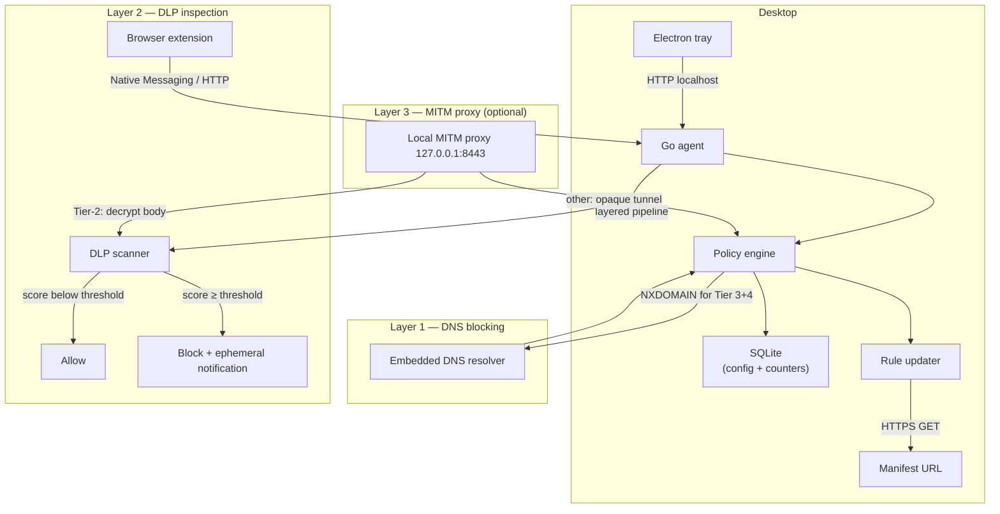
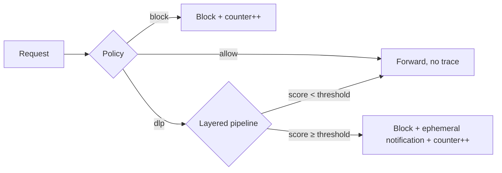

# ShieldNet Secure Edge — Architecture

## System overview



## Privacy invariant

Every access event (DNS query, HTTP request, DLP scan) follows the same flow:



**At no point** is a domain, URL, IP, user identifier, or request content
written to disk, SQLite, or any log. Counters are bare integers. DLP scan
content is held only in Go-managed memory and released for GC immediately
after the response is sent.

The exhaustive list of what reaches disk:

```
SQLite (~few KB):
├── rulesets               # rule-file metadata (name, type, path, category)
├── category_policies      # category → action (allow / allow_with_dlp / deny)
├── aggregate_stats        # 5 bare counters; singleton row
├── rule_versions          # manifest version strings
└── dlp_config             # singleton row of scoring weights + thresholds

Rule files (~500 KB):
├── ai_chat_blocked.txt    # domain lists (these are RULES, not access logs)
├── ai_code_blocked.txt
├── ai_chat_dlp.txt
├── ai_allowed.txt
├── phishing.txt  social.txt  news.txt
├── dlp_patterns.json      # DLP patterns
└── dlp_exclusions.json    # exclusion rules

Config (~1 KB):
└── config.yaml            # upstream DNS, ports, update URL
```

There is deliberately no `alert_events` table, no `access_log` table, no log
file, no access history. [`store/privacy_test.go`](./agent/internal/store/privacy_test.go)
enforces this on every text column in the database.

## Components

### Go agent (`agent/`)

A single statically-compiled binary. Subsystems:

| Subsystem    | Library / approach                              | Purpose                                                                                          |
|--------------|--------------------------------------------------|--------------------------------------------------------------------------------------------------|
| DNS resolver | `github.com/miekg/dns`                           | Listens on `127.0.0.1:53`; resolves queries against the policy engine                            |
| HTTP API     | `net/http` stdlib + token-bucket middleware       | Local REST API on `127.0.0.1:8080` for the tray and the extension                                |
| SQLite store | `modernc.org/sqlite` (pure Go, no CGO, WAL)      | Stores policies, counters, rule metadata. Versioned migrations driven by `PRAGMA user_version`   |
| DLP pipeline | In-process                                       | Classifier → Aho-Corasick → regex → hotwords + entropy + exclusions → scoring → threshold        |
| Rule updater | `net/http` stdlib                                | Polls a signed manifest, atomically replaces changed rule files, reloads the engine              |
| MITM proxy   | `github.com/elazarl/goproxy` (optional)          | Local HTTPS proxy on `127.0.0.1:8443`; decrypts only Tier-2 traffic                              |
| CA generator | `crypto/x509` + `crypto/ecdsa` P-256 (optional)  | Per-device Root CA generated on first proxy enable; leaf certs cached in-memory for 1 h          |
| Self-updater | `crypto/ed25519`, `net/http` (optional)          | Verifies SHA-256 + Ed25519 signature before staging a new binary                                 |
| Rate limiter | In-process token bucket                          | Configurable QPS limit on `/api/dlp/scan`                                                        |
| Scan cache   | TTL-bounded LRU (5 s default, hash-keyed)        | Deduplicates identical-content scans without persisting raw content                              |

**Memory profile.** ~15 MB RSS at idle plus ~200 KB for the DLP automaton and
exclusion sets. SQLite WAL keeps lock contention minimal.

**Logging.** Operational logs (startup, errors, config changes) go to stderr.
The binary never logs domains, URLs, IPs, or DLP match content. Log level is
configurable; production builds default to errors only.

### DLP pipeline (`agent/internal/dlp/`)

Instead of running every regex against every byte (O(n · p)), the pipeline is
staged:

```mermaid
flowchart TD
    A["Content"] --> B["Step 1: classifier (< 10 μs)"]
    B --> C["Step 2: Aho-Corasick single-pass (O(n))"]
    C --> D["Step 3: regex validation on AC candidates only"]
    D --> E["Step 4: per-match scoring (hotwords / entropy / exclusions)"]
    E --> F{"Step 5: score ≥ threshold[severity]?"}
    F -->|"yes"| G["Block + counter++"]
    F -->|"no"|  H["Allow"]
    G & H --> I["Content released for GC"]
```

Per-match scoring formula:

```
score = score_weight
      + (hotword_present     ? hotword_boost   : 0)
      + (entropy ≥ entropy_min ? entropy_boost : entropy_penalty)
      + (in_structured_context ? +1            : 0)
      + multi_match_boost * min(num_matches - 1, multi_match_cap)
      + (exclusion_word_nearby ? exclusion_penalty : 0)
      + (in_exclusion_dictionary ? -5           : 0)

block when score ≥ threshold[severity]
```

A pattern with `require_hotword: true` is suppressed entirely when no hotword
is present, regardless of score — useful for patterns like "Generic API Key"
that would otherwise match any 20+ char alphanumeric string.

#### Optional ML-augmented detection (`agent/internal/dlp/ml/`, draft)

The DLP pipeline supports an **optional** ML layer that adds two
narrowly-scoped signals on top of the deterministic pipeline. The layer is
strictly additive — when no model is loaded, when the ONNX runtime is not
available, or when `ScoreWeights.MLBoost` is `0`, every entry point is a
no-op and the pipeline behaves exactly as documented above.

| Signal              | When it fires                                                 | What it can do                                                                                                                                  |
|---------------------|---------------------------------------------------------------|-------------------------------------------------------------------------------------------------------------------------------------------------|
| **Pre-filter**      | After AC scan, before regex validation                        | Skip the remaining regex + scoring steps when (a) the embedder thinks the content is much closer to the TN centroid than the TP centroid and (b) no Critical / High AC candidate is in flight. Latency win on benign noise. |
| **Disambiguator**   | Inside `ScoreMatch`, on every borderline match                | Nudge the deterministic score by ±`MLBoost` *only* when it lands within `mlBorderlineWidth` of the per-severity block threshold. High-confidence blocks and high-confidence non-blocks are immune. |

Properties that make the layer reviewable line-by-line:

- **Pre-filter recall guard** — a Critical or High severity AC candidate
  always proceeds through regex + scoring + threshold, regardless of the
  embedder's verdict. The pre-filter is a *latency* shortcut for low-severity
  noise, never a recall hazard for high-severity secrets.
- **Disambiguator borderline gate** — the ML signal is consulted only for
  scores within `mlBorderlineWidth` (== 1) of the per-severity threshold,
  and is clamped to `±MLBoost`. A confident deterministic decision cannot be
  overridden by the ML layer in either direction.
- **Privacy invariant** — the embedder runs in-process. No embedding vector,
  no model output, and no scanned content leaves the process. The `ml`
  package does not open network sockets and does not log scan content.
- **Graceful degradation** — when the model file, tokenizer, or ONNX runtime
  is missing, the pipeline drops back to the fully-deterministic path
  silently. The `Null` embedder is the default and produces no signal.
- **Build-tag isolation** — the ONNX-backed embedder lives behind
  `//go:build onnx`. The default agent build, and CI, link only the
  `Null` embedder and the small classifier-head + cosine-similarity
  primitives. No CGO is required for the default build.

The default model is `paraphrase-multilingual-MiniLM-L12-v2` quantised to
int8 (~45 MB), distilled from XLM-RoBERTa, covering 50+ languages including
the W4 jurisdictions (CJK, Arabic, Thai, Hindi, European locales).
Inference budget: pre-filter ≤ 5 ms, disambiguator ≤ 10 ms, total ML
overhead ≤ 15 ms per scan on commodity CPU.

Model artefacts (centroids, disambiguator weights, ONNX model + tokenizer)
load from `~/.shieldnet/models/` by default. The release pipeline (separate
follow-up commit) bundles the per-OS ONNX C++ shared library; the model file
itself ships as a separate release asset.

**Performance budget (per scan):**

| Step                              | Time    | Memory                              |
|-----------------------------------|---------|-------------------------------------|
| Classification                    | < 10 μs | 0 (stack)                           |
| Aho-Corasick                      | < 100 μs| ~100 KB automaton (built once)      |
| Regex validation (candidates only)| < 500 μs| negligible                          |
| Scoring                           | < 200 μs| ~100 KB exclusion hash sets         |
| **Total**                         | **< 1 ms** | **~200 KB**                      |

Pattern and exclusion schemas, scoring weights, and the contributor workflow
live in [docs/dlp-pattern-authoring-guide.md](./docs/dlp-pattern-authoring-guide.md);
the full per-pattern table is in [SECURITY_RULES.md](./SECURITY_RULES.md).
Accuracy is enforced by a fast smoke test
([`accuracy_smoke_test.go`](./agent/internal/dlp/accuracy_smoke_test.go),
50 samples, FP < 10 % / FN < 5 %) and a large-scale evaluation
([`accuracy_large_test.go`](./agent/internal/dlp/accuracy_large_test.go),
5 000+ samples from
[`testdata/corpus/`](./agent/internal/dlp/testdata/corpus/), overall FP < 5 %,
overall FN < 3 %, per-category FN < 10 %). A companion regression test
([`accuracy_regression_test.go`](./agent/internal/dlp/accuracy_regression_test.go))
diffs each run against the committed `baseline_report.json` so a rule update
that silently regresses recall fails CI.

### Local MITM proxy (`agent/internal/proxy/`, optional)

Disabled by default. Opt-in via the Electron settings wizard or
`POST /api/proxy/enable`.

| Capability        | Approach                                                                                              |
|-------------------|-------------------------------------------------------------------------------------------------------|
| Listener          | `github.com/elazarl/goproxy` on `127.0.0.1:8443`                                                      |
| Per-device CA     | ECDSA P-256, generated at first enable, persisted to `~/.secure-edge/ca.{crt,key}`                    |
| Leaf certificates | Generated on demand, signed by the per-device CA, cached in-memory for 1 h                            |
| Policy hook       | `policy.Engine.CheckDomain == AllowWithDLP` → decrypt; everything else passes through opaquely        |
| Pinning bypass    | `proxy_pinning_bypass` config list forces opaque pass-through for apps that pin a specific CA         |
| DLP integration   | Decrypted bodies run through the same `dlp.Pipeline` as the extension path                            |
| Block response    | HTTP 451 with `{"blocked": true, "pattern_name": "..."}`; original request is never forwarded         |
| Counters          | Shares `dlp_scans_total` / `dlp_blocks_total` with the extension path                                 |
| Lifecycle         | `proxy.Controller` owns Enable / Disable / Status; exposed at `/api/proxy/{enable,disable,status}`    |

**Privacy invariant for the proxy.** Decrypted content terminates at the DLP
scan and is released for GC. The proxy emits no per-request logs and writes
no request/response bodies; `proxy/integration_test.go` captures stdout +
stderr during a Tier-2 request and asserts the body and Host header never
appear in the captured stream.

### Enterprise profiles (`agent/internal/profile/`)

Optional, server-distributed policy bundles.

| Capability  | Approach                                                                                                         |
|-------------|------------------------------------------------------------------------------------------------------------------|
| Schema      | `{name, version, managed, categories, dlp, rule_update_url, signature}` JSON                                     |
| Source      | Local file (`profile_path`) or HTTPS GET (`profile_url`); `profile_path` wins when both are set                  |
| SSRF defense| URL fetches use a custom `http.Transport` that pins the resolved IP and rejects RFC1918 / loopback / link-local  |
| Size cap    | 1 MiB; enforced in the loader so a hostile server cannot OOM the agent                                           |
| Verification| Ed25519 signature over the canonical JSON; `profile_public_key` must be configured (and trimmed non-empty)       |
| Apply       | Single transaction in `Store.ApplyProfileTx`: validates every category + DLP value, then commits atomically      |
| Lock        | When `managed=true`, `PUT /api/policies/:cat` and `PUT /api/dlp/config` return 403                               |
| Boot model  | Managed mode requires either `profile_path` or `profile_url`; failed managed-mode load is fail-closed (no boot)  |
| API         | `GET /api/profile`, `POST /api/profile/import` (body is `{url}` or `{profile}`)                                  |

### Tamper detection (`agent/internal/tamper/`)

| Capability   | Approach                                                                                                                |
|--------------|-------------------------------------------------------------------------------------------------------------------------|
| Cadence      | 60 s by default; `CheckNow()` for a one-shot                                                                            |
| DNS probe    | Linux/BSD/macOS read `resolv.conf` + `networksetup`; Windows uses `netsh interface ipv4 show dnsservers`                |
| Proxy probe  | macOS `networksetup -getwebproxy / -getsecurewebproxy`; Windows `netsh winhttp show proxy`; Linux falls back to env vars |
| Counter      | `Reporter.IncrementTamperDetections()` fires **only on transitions** — steady-state tamper does not double-count        |
| Notification | The tray polls `/api/tamper/status` every 10 s and shows an ephemeral balloon on the rising edge — no on-disk log       |

### Optional heartbeat (`agent/internal/heartbeat/`)

Off by default; setting `heartbeat_url` enables it. Payload is exactly
`{agent_version, os_type, os_arch, aggregate_counters}` — nothing else.
[`heartbeat_test.go`](./agent/internal/heartbeat/heartbeat_test.go)
deserialises the wire payload and asserts no key matches
`/url|domain|ip|match|host|pattern/i`.

### Admin overrides

| File                                       | Behaviour                                                              |
|--------------------------------------------|------------------------------------------------------------------------|
| `rules/local/allow.txt`                    | Domains forced into the `allow_admin` category                         |
| `rules/local/block.txt`                    | Domains forced into the `block_admin` category                         |
| `rules/local/dlp_patterns_override.json`   | Patterns with the same `name` replace bundled; others append           |
| `rules/local/dlp_exclusions_override.json` | Exclusions deduplicated by `(type, applies_to, pattern, words)` tuple  |

`rules/override.go` enforces mutual exclusivity (adding a domain to allow
removes it from block, and vice versa) and uses an atomic temp-file + rename
write so a crash mid-write cannot corrupt the list. Bundled files are never
mutated; the merge happens in memory at load time.

Operators may register additional category names with the store via
`cfg.RulePaths` so that a custom rule file (e.g. `gaming.txt` → `Gaming`)
becomes a first-class policy category, addressable by `PUT
/api/policies/:category`.

### Agent self-update (`agent/internal/updater/`)

Opt-in: inert unless both `agent_update_manifest_url` and
`agent_update_public_key` (hex-encoded Ed25519) are set. The updater polls
a release manifest, verifies the SHA-256 of the downloaded binary, then
verifies the Ed25519 signature over that hash, and only then stages the
binary for the next restart. Any verification failure aborts the update;
no partial binary ever overwrites the live install.

### Electron tray (`electron/`)

Minimal Electron shell for tray presence and a settings window.

```
electron/
├── main.ts              # Tray icon, health polling, BrowserWindow lifecycle
├── preload.ts           # contextBridge — the only renderer ↔ main surface
└── src/
    ├── pages/{Settings,Status,ProxySettings,Rules,Setup}.tsx
    ├── components/{CategoryToggle,StatsCard}.tsx
    └── api/agent.ts     # HTTP client to the Go agent on localhost
```

Tray icon is created at startup with near-zero overhead. The `BrowserWindow`
is created lazily on "Open Settings" and **destroyed** (not hidden) on close
to free Chromium memory. Estimated overhead: ~5 MB tray-only, ~35 MB when the
window is open. There is deliberately **no reports page** — the Status page
shows only anonymous counters.

### Companion extension (`extension/`)

TypeScript Manifest V3 extension. Three manifests share most of the codebase:

- `manifest.json` — Chrome
- `manifest.firefox.json` — Firefox (`browser_specific_settings.gecko`)
- `manifest.safari.json` — Safari (`browser_specific_settings.safari`)

`npm run build:firefox` produces `dist-firefox/`; `npm run build:safari`
produces `dist-safari/` and wraps it with
`xcrun safari-web-extension-converter` into an Xcode project at
`dist-safari-xcode/` (macOS-only).

Safari Web Extensions do not implement `chrome.runtime.connectNative`, so the
Safari port skips Native Messaging entirely and uses the HTTP fallback
exclusively. The agent's CORS allowlist accepts `chrome-extension://`,
`moz-extension://`, and `safari-web-extension://<UUID>` origins.

**Content scripts** injected on Tier-2 hosts:

- `paste-interceptor.ts` — `paste` events
- `form-interceptor.ts` — `<form>` `submit` events; concatenates textarea +
  text input values before scanning
- `network-interceptor.ts` — monkey-patches `window.fetch` and
  `XMLHttpRequest.prototype.send` to scan outbound bodies > 50 bytes
- `drag-interceptor.ts` — `drop` events
- `clipboard-monitor.ts` — optional, scans clipboard on tab focus (off by default)

**Background worker.** `dynamic-hosts.ts` polls `/api/rules/status` and
dynamically registers content scripts for custom Tier-2 hosts surfaced by
the admin override mechanism, so newly admin-added domains light up without
an extension reinstall. The worker prefers Chrome Native Messaging
(`chrome.runtime.connectNative('com.secureedge.agent')`) and falls back to
direct HTTP (`POST 127.0.0.1:8080/api/dlp/scan`) when the native host is
unavailable. Both paths share the same `dlp.Pipeline.Scan()` on the agent.

**Block UX.** An ephemeral toast shows the pattern name only — never the
matched content. The toast is sanitised to printable ASCII so a hostile
pattern name cannot trivially trigger XSS. Any agent error or timeout
**falls open** (the action is allowed) so a crashed agent never blocks
productivity.

**Native Messaging host manifest.** `extension/native-messaging/com.secureedge.agent.json`
is installed per-user by `install.sh` (macOS / Linux) or `install.ps1`
(Windows). The agent binary launched with `--native-messaging` speaks the
Chrome protocol (4-byte little-endian length prefix + JSON payload) on
stdin/stdout, without standing up the DNS / API server.

### Rule updater (`agent/internal/rules/updater.go`)

Polls `rule_update_url` on a configurable cadence (default 6 h):

1. `GET` the manifest. Schema:
   `{version: string, files: [{name, sha256, url?}], signature}`.
2. The manifest is Ed25519-verified against `rule_update_public_key` when
   one is configured; verification failure aborts the update.
3. For each file, compute the SHA-256 of the existing copy in `rules_dir`.
   Skip the file when it already matches the manifest entry.
4. Otherwise, download to a temp path next to the destination, verify
   SHA-256, then `os.Rename` onto the destination — atomic on POSIX and
   NTFS, so a partial file cannot be observed by the rest of the agent.
5. After any file is replaced, call the reload callback wired by
   `cmd/agent/main.go`: `policy.Engine.Reload(ctx)` re-ingests the domain
   lookup map and `dlp.Pipeline.Rebuild(...)` reconstructs the
   Aho-Corasick automaton + exclusion sets.
6. Append the new version string to `rule_versions` for audit and update
   the in-memory `currentVersion` / `lastCheck` / `nextCheck` fields used
   by `GET /api/rules/status`.

The updater rejects manifest entries whose `name` contains a path
separator, parent reference (`..`), or leading dot. Relative URLs are
resolved against the manifest's own URL.

## SQLite schema

```sql
CREATE TABLE rulesets (
    id          INTEGER PRIMARY KEY AUTOINCREMENT,
    uuid        TEXT UNIQUE NOT NULL,
    name        TEXT NOT NULL,
    rule_type   TEXT NOT NULL DEFAULT 'dstdomain',
    file_path   TEXT NOT NULL,
    category    TEXT NOT NULL,
    created_at  DATETIME DEFAULT CURRENT_TIMESTAMP,
    updated_at  DATETIME DEFAULT CURRENT_TIMESTAMP
);

CREATE TABLE category_policies (
    id          INTEGER PRIMARY KEY AUTOINCREMENT,
    category    TEXT UNIQUE NOT NULL,
    action      TEXT NOT NULL DEFAULT 'deny',  -- 'allow' | 'allow_with_dlp' | 'deny'
    updated_at  DATETIME DEFAULT CURRENT_TIMESTAMP
);

CREATE TABLE aggregate_stats (
    id                       INTEGER PRIMARY KEY CHECK (id = 1),  -- singleton row
    dns_queries_total        INTEGER NOT NULL DEFAULT 0,
    dns_blocks_total         INTEGER NOT NULL DEFAULT 0,
    dlp_scans_total          INTEGER NOT NULL DEFAULT 0,
    dlp_blocks_total         INTEGER NOT NULL DEFAULT 0,
    tamper_detections_total  INTEGER NOT NULL DEFAULT 0,
    last_reset_at            DATETIME DEFAULT CURRENT_TIMESTAMP
);

CREATE TABLE rule_versions (
    id               INTEGER PRIMARY KEY AUTOINCREMENT,
    manifest_version TEXT NOT NULL,
    updated_at       DATETIME DEFAULT CURRENT_TIMESTAMP
);

CREATE TABLE dlp_config (
    id                  INTEGER PRIMARY KEY CHECK (id = 1),  -- singleton row
    threshold_critical  INTEGER NOT NULL DEFAULT 1,
    threshold_high      INTEGER NOT NULL DEFAULT 2,
    threshold_medium    INTEGER NOT NULL DEFAULT 3,
    threshold_low       INTEGER NOT NULL DEFAULT 4,
    hotword_boost       INTEGER NOT NULL DEFAULT 2,
    entropy_boost       INTEGER NOT NULL DEFAULT 1,
    entropy_penalty     INTEGER NOT NULL DEFAULT -2,
    exclusion_penalty   INTEGER NOT NULL DEFAULT -3,
    multi_match_boost   INTEGER NOT NULL DEFAULT 1,
    updated_at          DATETIME DEFAULT CURRENT_TIMESTAMP
);
-- NOTE: there is deliberately no alert_events or access_log table.
```

The schema is migrated forward by `PRAGMA user_version` — `migrateV1` creates
the five baseline tables; `migrateV2` adds `tamper_detections_total` to
`aggregate_stats` via a `columnExists()` probe rather than string-matching the
`ALTER TABLE` error.

## DNS resolver flow

```mermaid
flowchart TD
    A["DNS query"] --> B{"Domain in rule files?"}
    B -->|"no"|  C["Forward upstream"]
    B -->|"yes"| D{"Category action?"}
    D -->|"deny"|         E["NXDOMAIN"]
    D -->|"allow"|        C
    D -->|"allow_with_dlp"| C
    C --> F["Return resolved IP"]
    E --> G["dns_blocks_total++   (no domain stored)"]
    A --> H["dns_queries_total++  (no domain stored)"]
```

The resolver holds an in-memory hash map of blocked domains loaded from the
rule files; lookup is O(1). Rule files are re-read only when the updater
detects a new version. Counters are atomically incremented in memory and
flushed to SQLite every `stats_flush_interval` (default 60 s).

## Platform integration

### macOS

| Capability         | Approach                                                                | Admin |
|--------------------|-------------------------------------------------------------------------|-------|
| DNS override       | `networksetup -setdnsservers Wi-Fi 127.0.0.1`                            | Yes (one-time) |
| System proxy (opt) | `networksetup -setsecurewebproxy / -setwebproxy Wi-Fi 127.0.0.1 8443`    | Yes (one-time) |
| CA trust (opt)     | `security add-trusted-cert` to the System Keychain                       | Yes (one-time) |
| Auto-start         | LaunchDaemon plist in `/Library/LaunchDaemons/`                          | Yes (installer) |
| Installer          | `.pkg` via `pkgbuild` + `productbuild`                                   | Standard |

### Windows

| Capability         | Approach                                                                | Admin |
|--------------------|-------------------------------------------------------------------------|-------|
| DNS override       | `netsh` or WMI adapter DNS setting                                       | Yes (one-time) |
| System proxy (opt) | Registry `HKCU\...\Internet Settings\ProxyServer`                        | No (user-level) |
| CA trust (opt)     | `certutil -addstore -f "Root" ca.crt`                                    | Yes (UAC) |
| Auto-start         | Windows Service via `golang.org/x/sys/windows/svc`                       | Yes (installer) |
| Installer          | MSI via WiX Toolset                                                      | Standard |

### Linux

| Capability                | Approach                                                                  | Admin |
|---------------------------|---------------------------------------------------------------------------|-------|
| DNS override              | Modify `/etc/resolv.conf` or `systemd-resolved`                            | Yes (root) |
| Transparent redirect (opt)| `iptables -t nat -A OUTPUT -p tcp --dport 443 -j REDIRECT --to-port 8443`  | Yes (root) |
| CA trust (opt)            | Copy to `/usr/local/share/ca-certificates/` + `update-ca-certificates`     | Yes (root) |
| Auto-start                | systemd unit                                                               | Yes (root) |
| Installer                 | `.deb` + `.rpm` via `nfpm`                                                 | Standard |

Per-platform installer entry points live in `scripts/macos/`,
`scripts/windows/`, and `scripts/linux/`.

## API surface

The full table of endpoints, return shapes, and `503`-fallback conditions
lives in [README.md § API](./README.md#api). Privacy notes that apply to
every endpoint:

- `/api/status`, `/api/stats`, `/api/stats/export` expose integers and
  metadata only — no domains, URLs, IPs, or DLP match content.
- `/api/dlp/scan` processes content in memory and never persists it.
- There is no `/api/alerts` and no `/api/logs` endpoint, by design.
