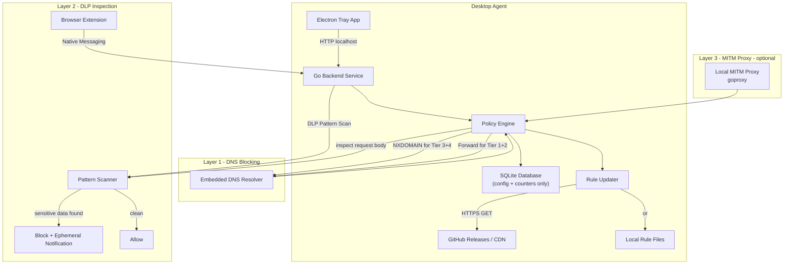
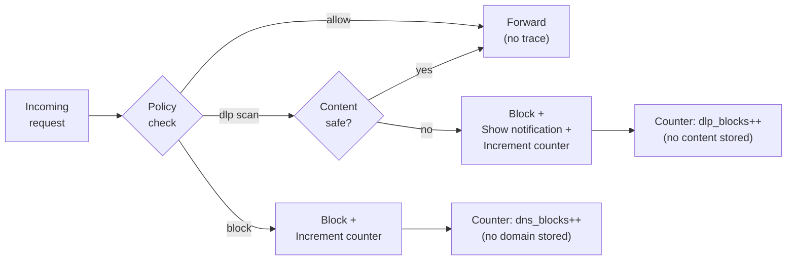
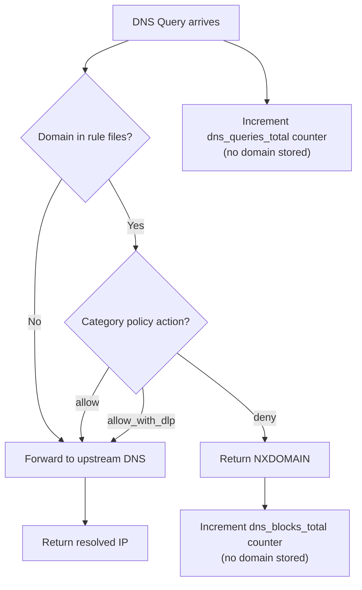
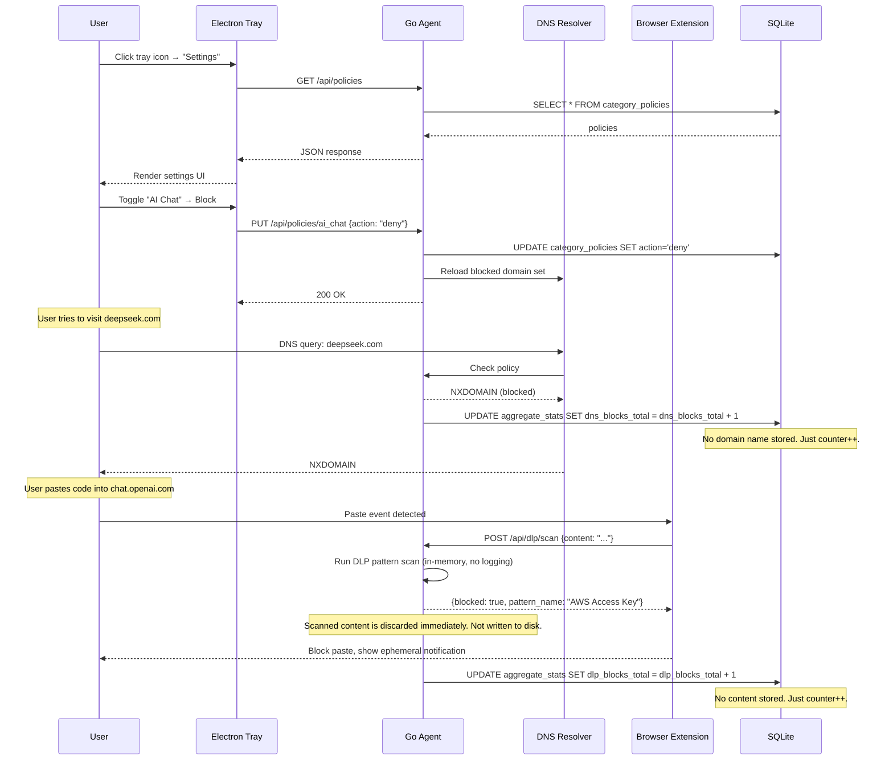

# ShieldNet Secure Edge — Technical Architecture

## System Overview



## Privacy Architecture

### Data Flow Principle: Process, Don't Persist

Every access event (DNS query, HTTP request, DLP scan) follows this flow:



**Key invariant:** At no point in the data flow is a domain name, URL, IP address, or request content written to any persistent storage (disk, database, log file). Counters are bare integers.

### What Gets Stored (Exhaustive List)

```
SQLite Database (~4 KB):
├── category_policies     # category → action mapping (e.g., "AI Chat" → "deny")
├── rulesets              # rule file metadata (name, type, path, category)
├── aggregate_stats       # dns_blocks_total: 142, dlp_blocks_total: 7, dns_queries_total: 50321
└── rule_versions         # manifest version string for update tracking

Rule Files (~500 KB):
├── ai_chat_blocked.txt   # domain lists (these are the RULES, not access logs)
├── phishing.txt
└── dlp_patterns.json

Config File (~1 KB):
└── config.yaml           # upstream DNS, ports, update URL
```

**There is no `alert_events` table. There is no log file. There is no access history.**

## Component Details

### 1. Go Backend Service

The core of the agent. A single statically-compiled Go binary providing:

| Subsystem | Library | Purpose |
|-----------|---------|---------|
| DNS Resolver | `github.com/miekg/dns` | Listens on `127.0.0.1:53`, resolves queries against policy engine |
| HTTP API | `net/http` (stdlib) | Local REST API on `127.0.0.1:{PORT}` for Electron UI and browser extension |
| SQLite Store | `modernc.org/sqlite` | Pure Go SQLite — stores policies, counters, rule metadata. No CGO. No access logs. |
| Rule Updater | `net/http` (stdlib) | Polls `manifest.json` for rule version, downloads changed files |
| MITM Proxy | `github.com/elazarl/goproxy` | Optional. Local proxy for Tier 2 non-browser inspection |
| CA Generator | `crypto/x509` (stdlib) | Optional. Generates per-device Root CA for MITM proxy |

**Memory profile:** ~15 MB RSS at idle. DNS server is event-driven (goroutine-per-request, no
pre-allocated pools). SQLite WAL mode for minimal lock contention.

**Logging policy:** The Go binary writes operational logs to stderr (startup, errors, config changes). It NEVER logs domain names, URLs, or IP addresses from user traffic. Log level is configurable; in production, only errors are logged.

### 2. Electron Tray Application

Minimal Electron shell for system tray presence and settings UI.

```
electron/
├── main.ts              # Main process: tray icon, IPC, window management
├── preload.ts           # Secure bridge to renderer
├── src/
│   ├── pages/
│   │   ├── Settings.tsx       # Policy toggles (adapted from PoliciesPage)
│   │   └── Status.tsx         # Agent health + anonymous aggregate stats
│   ├── components/
│   │   ├── CategoryToggle.tsx # Three-state: Allow / Allow+Inspect / Block
│   │   └── StatsCard.tsx      # Display aggregate counters
│   └── api/
│       └── agent.ts           # HTTP client to Go backend on localhost
├── package.json
└── electron-builder.yml
```

**Resource strategy:**
- Tray icon created immediately (near-zero overhead)
- `BrowserWindow` created only when user clicks "Open Settings"
- Window is **destroyed** (not hidden) on close to free Chromium memory
- No background renderer processes when window is closed
- Estimated overhead: ~35 MB when window is open, ~5 MB tray-only

**No Reports page.** Since we don't log access events, there is no detailed reports page.
The Status page shows only anonymous counters: "Total blocks: 142 | DLP blocks: 7 | Uptime: 3d 14h".

### 3. Browser Extension (Chrome + Firefox)

TypeScript extension using Manifest V3 (Chrome) and WebExtensions (Firefox).

**Capabilities:**
- Content script injected into Tier 2 AI tool domains only
- Intercepts: `paste` events, form `submit`, `fetch`/`XMLHttpRequest` calls
- Scans intercepted content against DLP regex patterns locally
- Communicates with Go agent via Chrome Native Messaging API
- Shows ephemeral notification on block (never persisted)

**Privacy:** The extension does not store any history of scanned content. When a DLP pattern
matches, the notification displays the pattern name (e.g., "AWS Access Key detected") but
does NOT include the matched content itself. After the user dismisses the notification, no
trace remains.

### 4. SQLite Database Schema

```sql
-- Rule file metadata (adapted from WebfilteringRuleset model)
CREATE TABLE rulesets (
    id          INTEGER PRIMARY KEY AUTOINCREMENT,
    uuid        TEXT UNIQUE NOT NULL,
    name        TEXT NOT NULL,
    rule_type   TEXT NOT NULL DEFAULT 'dstdomain',
    file_path   TEXT NOT NULL,
    category    TEXT NOT NULL,
    created_at  DATETIME DEFAULT CURRENT_TIMESTAMP,
    updated_at  DATETIME DEFAULT CURRENT_TIMESTAMP
);

-- Policy configuration (extended from RulesetConfig bool → three-state)
CREATE TABLE category_policies (
    id          INTEGER PRIMARY KEY AUTOINCREMENT,
    category    TEXT UNIQUE NOT NULL,
    action      TEXT NOT NULL DEFAULT 'deny',  -- 'allow', 'allow_with_dlp', 'deny'
    updated_at  DATETIME DEFAULT CURRENT_TIMESTAMP
);

-- Anonymous aggregate counters (NO domain, NO IP, NO timestamp per event)
CREATE TABLE aggregate_stats (
    id                  INTEGER PRIMARY KEY CHECK (id = 1),  -- singleton row
    dns_queries_total   INTEGER NOT NULL DEFAULT 0,
    dns_blocks_total    INTEGER NOT NULL DEFAULT 0,
    dlp_scans_total     INTEGER NOT NULL DEFAULT 0,
    dlp_blocks_total    INTEGER NOT NULL DEFAULT 0,
    last_reset_at       DATETIME DEFAULT CURRENT_TIMESTAMP
);

-- Rule update tracking
CREATE TABLE rule_versions (
    id               INTEGER PRIMARY KEY AUTOINCREMENT,
    manifest_version TEXT NOT NULL,
    updated_at       DATETIME DEFAULT CURRENT_TIMESTAMP
);

-- NOTE: There is deliberately NO alert_events table.
-- NOTE: There is deliberately NO access_log table.
-- This is a privacy design decision, not an oversight.
```

### 5. DNS Resolver Flow



**Implementation detail:** The DNS resolver maintains an in-memory trie/map of blocked domains
loaded from rule files. Lookup is O(1) hash map check. Rule files are re-read only when the
updater detects a new version. Counters are atomically incremented in-memory and flushed to
SQLite periodically (e.g., every 60 seconds) to minimize disk I/O.

### 6. Platform-Specific Integration

#### macOS
| Capability | Approach | Admin Required |
|---|---|---|
| DNS override | `networksetup -setdnsservers Wi-Fi 127.0.0.1` | Yes (one-time) |
| System proxy (opt) | `networksetup -setsecurewebproxy Wi-Fi 127.0.0.1 8443` | Yes (one-time) |
| CA trust (opt) | `security add-trusted-cert` to System Keychain | Yes (one-time) |
| Auto-start | LaunchDaemon plist in `/Library/LaunchDaemons/` | Yes (installer) |
| Installer | `.pkg` via `pkgbuild` + `productbuild` | Standard |

#### Windows
| Capability | Approach | Admin Required |
|---|---|---|
| DNS override | `netsh` or WMI adapter DNS setting | Yes (one-time) |
| System proxy (opt) | Registry `HKCU\...\Internet Settings\ProxyServer` | No (user-level) |
| CA trust (opt) | `certutil -addstore -f "Root" ca.crt` | Yes (UAC prompt) |
| Auto-start | Windows Service via `golang.org/x/sys/windows/svc` | Yes (installer) |
| Installer | MSI via WiX Toolset | Standard |

#### Linux
| Capability | Approach | Admin Required |
|---|---|---|
| DNS override | Modify `/etc/resolv.conf` or `systemd-resolved` | Yes (root) |
| Transparent redirect (opt) | `iptables -t nat -A OUTPUT -p tcp --dport 443 -j REDIRECT --to-port 8443` | Yes (root) |
| CA trust (opt) | Copy to `/usr/local/share/ca-certificates/` + `update-ca-certificates` | Yes (root) |
| Auto-start | systemd unit file | Yes (root) |
| Installer | `.deb` + `.rpm` via `nfpm` | Standard |

### 7. Rule File Format

Directly compatible with ShieldNet's existing format:

```
# ai_chat_blocked.txt
# One domain per line, leading dot = includes all subdomains
.deepseek.com
.poe.com
.perplexity.ai
.you.com
.phind.com
```

```json
// dlp_patterns.json
{
  "patterns": [
    {
      "name": "AWS Access Key",
      "regex": "AKIA[0-9A-Z]{16}",
      "severity": "critical"
    },
    {
      "name": "Generic API Key",
      "regex": "(?i)(api[_-]?key|apikey)\\s*[:=]\\s*['\"]?[A-Za-z0-9_\\-]{20,}",
      "severity": "high"
    },
    {
      "name": "Email Addresses (bulk)",
      "regex": "([a-zA-Z0-9_.+-]+@[a-zA-Z0-9-]+\\.[a-zA-Z0-9-.]+)",
      "severity": "medium",
      "min_matches": 5
    }
  ]
}
```

### 8. Communication Diagram



### 9. API Endpoints

| Method | Path | Description | Privacy Notes |
|--------|------|-------------|---------------|
| `GET` | `/api/status` | Agent health, uptime | No user data |
| `GET` | `/api/policies` | List category policies | Config only |
| `PUT` | `/api/policies/:category` | Update policy action | Config only |
| `GET` | `/api/stats` | Anonymous aggregate counters | Integers only, no domains/IPs |
| `POST` | `/api/stats/reset` | Reset counters to zero | — |
| `POST` | `/api/dlp/scan` | Scan content for DLP patterns | Content processed in-memory, never persisted |
| `GET` | `/api/rules` | List loaded rule files | Metadata only |
| `POST` | `/api/rules/update` | Trigger rule file update check | — |

**There is no `/api/alerts` endpoint. There is no `/api/logs` endpoint. This is by design.**
